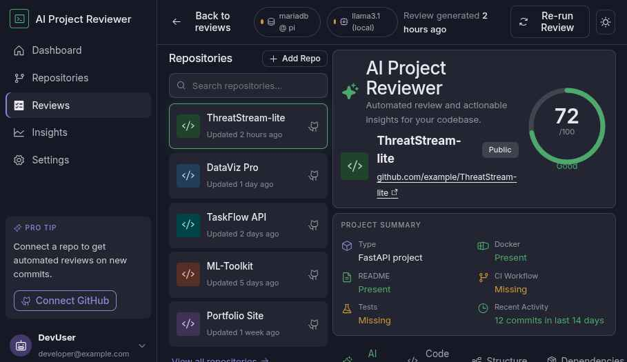
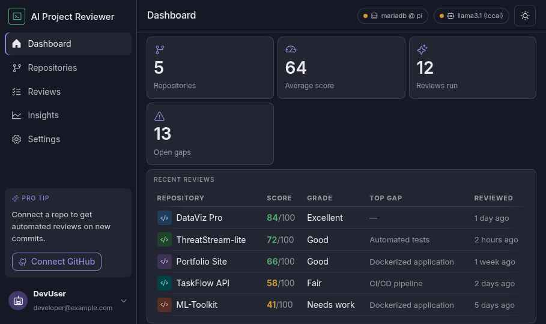
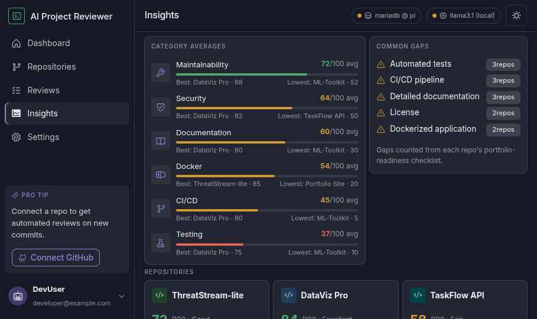
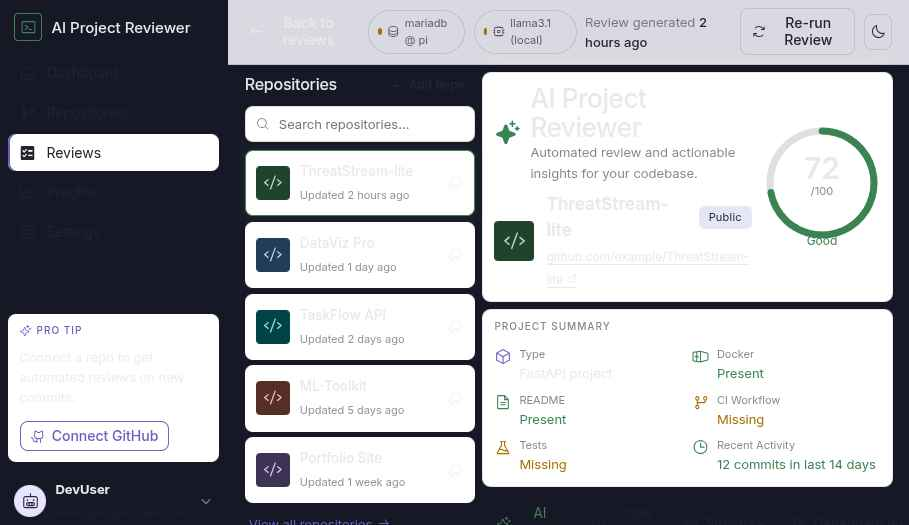

# AI Project Reviewer

AI Project Reviewer is a self-hosted dashboard for evaluating software repositories and turning review data into practical, portfolio-focused feedback. It presents an overall score, category scores, strengths, improvement areas, recommended next steps, dependency and security findings, and cross-repository insights.

The project is designed to run on a local network with MariaDB for persistence and Ollama for local AI summaries. No hosted application or cloud AI service is required.



> [!IMPORTANT]
> The project is under active development. The frontend and MariaDB-backed read API are implemented. Automated repository cloning, static analysis, persisted review jobs, and deployment packaging are still on the roadmap. Until those pieces land, the application uses seeded reviews or embedded sample data.

## What Works Today

- Portfolio dashboard with repository counts, average score, open gaps, recent reviews, and weakest categories
- Detailed repository reviews with AI Review, Code Quality, Structure, Dependencies, and Security tabs
- Portfolio-readiness checklists and recommended next steps
- Cross-repository category averages and common-gap insights
- Responsive dark and light themes with a saved theme preference
- Fastify REST API backed by MariaDB
- Idempotent schema migration and repeatable sample-data seeding
- Standalone frontend fallback when the API is unavailable
- Optional direct Ollama summary generation from the review screen

The Repositories and Settings screens are currently placeholders. The API can register a repository, but newly registered repositories do not appear in the review list until a review record exists.

## Screenshots

| Dashboard | Insights |
| --- | --- |
|  |  |

| Review: dark theme | Review: light theme |
| --- | --- |
|  |  |

## Architecture

```text
React + Vite frontend
    |-- GET /api/repos -----------------> Fastify API -----> MariaDB
    |-- GET /api/repos/:id                  |
    |-- POST /api/repos                     +-- schema migration
    |                                       +-- sample-data seed
    |
    +-- POST /api/generate ------------> Ollama (optional, local)

If the API cannot be reached, the frontend renders embedded sample reviews.
If Ollama cannot be reached, re-running a review returns the existing sample summary.
```

### Technology Stack

| Area | Technology |
| --- | --- |
| Frontend | React, Vite, TypeScript, React Router, plain CSS |
| API | Node.js, Fastify, TypeScript |
| Database | MariaDB through `mysql2/promise` |
| Local AI | Ollama-compatible `/api/generate` endpoint |
| Icons | Phosphor Icons |

## Quick Start

### Standalone Frontend

The fastest way to explore the interface is to run the frontend by itself. It automatically uses the five embedded sample reviews when the API is unavailable.

```bash
git clone https://github.com/jimjamscott22/AI-Project-Reviewer.git
cd AI-Project-Reviewer/frontend
npm install
npm run dev
```

Open <http://localhost:5173>.

### Frontend with MariaDB

You will need:

- Node.js `20.19+` or `22.12+`
- npm
- A reachable MariaDB server
- MariaDB credentials allowed to create the configured database and tables

Start the API first:

```bash
cd api
cp .env.example .env
npm install
```

Edit `api/.env` for your MariaDB instance, then initialize and start the service:

```bash
npm run migrate
npm run seed
npm run dev
```

In another terminal, start the frontend:

```bash
cd frontend
npm install
npm run dev
```

The development frontend is already configured to use `http://localhost:8080`. Open <http://localhost:5173>; the MariaDB status chip turns green when the API returns review data.

`npm run migrate` creates the configured database and applies the schema idempotently. `npm run seed` replaces only the bundled sample repositories and their related reviews, so it is safe to rerun during development.

## Configuration

### API

Copy [`api/.env.example`](api/.env.example) to `api/.env` and configure:

| Variable | Default | Purpose |
| --- | --- | --- |
| `PORT` | `8080` | API listen port |
| `CORS_ORIGIN` | `http://localhost:5173` | Allowed frontend origin |
| `DB_HOST` | `localhost` | MariaDB host |
| `DB_PORT` | `3306` | MariaDB port |
| `DB_USER` | `apr` | MariaDB user |
| `DB_PASSWORD` | `apr` | MariaDB password |
| `DB_NAME` | `apr` | Database created and used by the API |

### Frontend

Vite reads these variables at startup:

| Variable | Development value | Purpose |
| --- | --- | --- |
| `VITE_API_BASE` | `http://localhost:8080` | Fastify API base URL |
| `VITE_LLM_BASE` | `http://raspberrypi.local:11434` | Ollama base URL |
| `VITE_LLM_MODEL` | `llama3.1` | Ollama model used for summaries |

The checked-in [`frontend/.env.development`](frontend/.env.development) sets the local API URL. Override the Ollama values in a local Vite environment file when needed, then restart the development server.

## API

The implemented API surface is:

| Method | Endpoint | Description |
| --- | --- | --- |
| `GET` | `/api/health` | Check API and database availability |
| `GET` | `/api/repos` | List repositories with their latest reviews |
| `GET` | `/api/repos/:id` | Get one repository and its latest review |
| `POST` | `/api/repos` | Register repository metadata |

Example:

```bash
curl http://localhost:8080/api/health
curl http://localhost:8080/api/repos
```

Registering a repository currently stores its metadata only:

```bash
curl -X POST http://localhost:8080/api/repos \
  -H 'content-type: application/json' \
  -d '{"url":"https://github.com/example/project"}'
```

The planned review-job endpoints are not implemented yet.

## Development Commands

Run commands from the relevant workspace directory.

| Workspace | Command | Purpose |
| --- | --- | --- |
| `frontend/` | `npm run dev` | Start the Vite development server |
| `frontend/` | `npm run build` | Type-check and create a production build |
| `frontend/` | `npm run lint` | Lint frontend source files |
| `frontend/` | `npm run preview` | Preview the production build |
| `api/` | `npm run dev` | Start the API with file watching |
| `api/` | `npm run build` | Compile TypeScript into `api/dist/` |
| `api/` | `npm start` | Run the compiled API |
| `api/` | `npm run typecheck` | Type-check without emitting files |
| `api/` | `npm run lint` | Lint API source files |
| `api/` | `npm run migrate` | Create the database and apply the schema |
| `api/` | `npm run seed` | Load the bundled sample reviews |

There is not yet an automated test suite. The current validation baseline is linting, API type-checking, and production builds for both workspaces.

## Project Structure

```text
.
|-- api/                              Fastify API and MariaDB access
|   |-- src/db/                       schema, migrations, queries, and seed data
|   |-- src/routes/                   health and repository routes
|   `-- src/types.ts                  API response model
|-- frontend/                         React application
|   |-- src/components/               shared interface components
|   |-- src/data/                     API adapter, types, and sample reviews
|   |-- src/screens/                  dashboard, review, and insights screens
|   `-- src/styles/                   Nocturne tokens and application styles
|-- design_handoff_ai_project_reviewer/
|   |-- prototype/                    original interactive design reference
|   |-- screenshots/                  approved screen references
|   `-- IMPLEMENTATION_PLAN.md         milestone roadmap and target architecture
|-- LICENSE
`-- README.md
```

The files under [`design_handoff_ai_project_reviewer/`](design_handoff_ai_project_reviewer/) are retained as the original design reference. They are not the production application; active code lives in `frontend/` and `api/`.

## Roadmap

- [x] M1: React frontend and routed review experience
- [x] M2: MariaDB schema, seed data, and repository read API
- [ ] M3: Repository ingestion, static analysis, review jobs, and persisted reruns
- [ ] M4: Ollama-backed narrative generation integrated into the review pipeline
- [ ] M5: Docker Compose packaging and Raspberry Pi deployment

See the original [implementation plan](design_handoff_ai_project_reviewer/IMPLEMENTATION_PLAN.md) for the intended milestone details. Roadmap items describe direction, not completed functionality.

## License

Licensed under the [Apache License 2.0](LICENSE).
